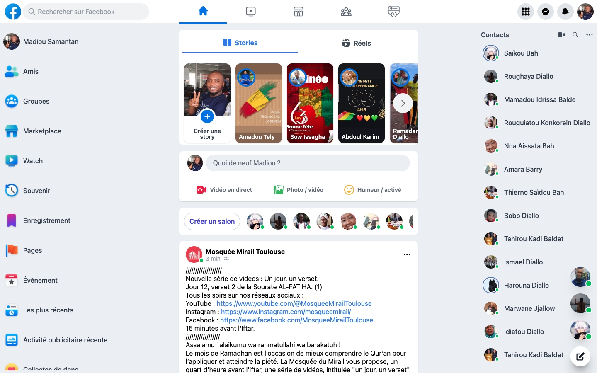
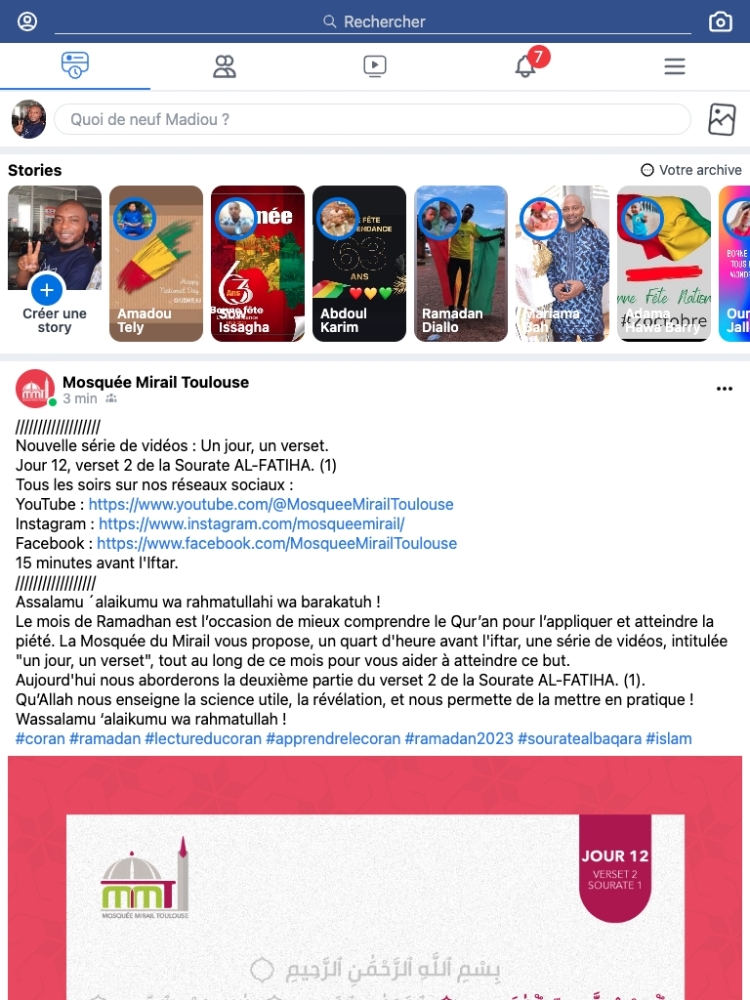

# Facebook clone
Facebook clone using React and Tailwindcss.

This repository is a reproduction of the facebook home page design.
You can clone it, test it to see the result, get inspiration from it or pull on if needed, but you are not allowed to use it in real life for your real projects.

If you like this reproduction, please click on project star to encourage me.

### Home Page Facebook clone


### Screenshots





## Installation

Clone the repo locally:

```sh
git clone https://github.com/madiou84/facebook-clone facebook-clone
cd facebook-clone
```

Install JavaScript dependencies:

```sh
yarn install
```
OR
```sh
npm install
```

If you have any problem I recommend that you refer to the react documentation.